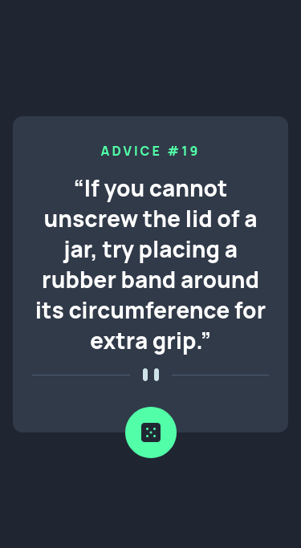
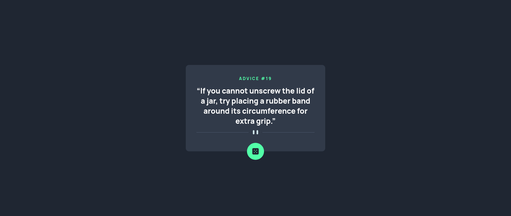

# Advice generator app

My solution for the [Advice generator app challenge on Frontend Mentor](https://www.frontendmentor.io/challenges/advice-generator-app-QdUG-13db) using *React*.

## Table of contents

- [Overview](#overview)
  - [The challenge](#the-challenge)
  - [Screenshot](#screenshot)
  - [Links](#links)
- [My process](#my-process)
  - [Built with](#built-with)
- [Author](#author)

## Overview

### The challenge

Users should be able to:

- View the optimal layout for the app depending on their device's screen size
- See hover states for all interactive elements on the page
- Generate a new piece of advice by clicking the dice icon

### Screenshot

<table>
        <tr>
            <td>
                
            </td>
		    <td>
                
            </td>
        </tr>
</table>

### Links

- Solution URL: [https://www.frontendmentor.io/solutions/advice-generator-app-VVrwa9pGXT](https://www.frontendmentor.io/solutions/advice-generator-app-VVrwa9pGXT)
- Live Site URL: [https://advice-generator-app-gmaitor.vercel.app/](https://advice-generator-app-gmaitor.vercel.app/)

## My process

### Built with

- Semantic HTML5 markup
- CSS custom properties
- Flexbox
- [React](https://reactjs.org/) - JS library
- [Vite](https://vitejs.dev/) - Build tool

## Author

- Frontend Mentor - [@AitorGallardo](https://www.frontendmentor.io/profile/AitorGallardo)
